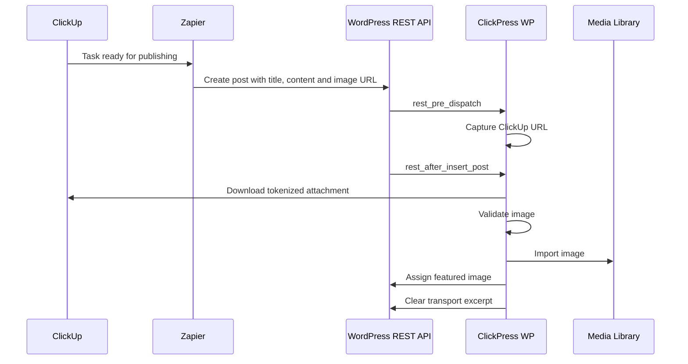

# Architecture

## Components

### ClickUp

ClickUp stores the article title, body, workflow status, and AI-generated image attachment.

### Zapier

Zapier detects that the task is ready and creates the WordPress post through the REST API.

### WordPress REST API

The REST API receives the post content and temporary ClickUp attachment URL.

### ClickPress WP

The plugin captures the URL, downloads and validates the file, imports it into the Media Library, assigns it as the featured image, and cleans temporary data.

## Processing sequence

## Design decisions

- The Excerpt is used because Zapier exposes it in the standard WordPress Create Post action.
- `wp_remote_get()` is used because it proved more reliable than `download_url()` for ClickUp AI-generated attachment URLs.
- The complete URL is tried first because removing `authz_token` may return an HTML page instead of the image.
- The plugin does not overwrite existing featured images.
